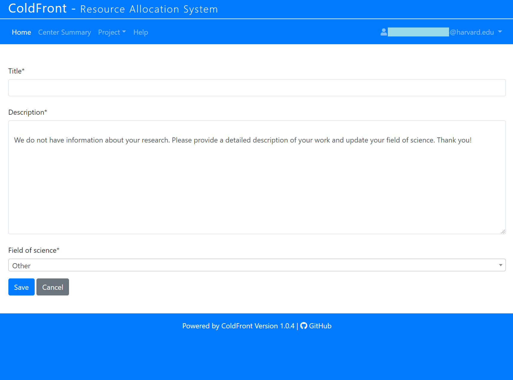
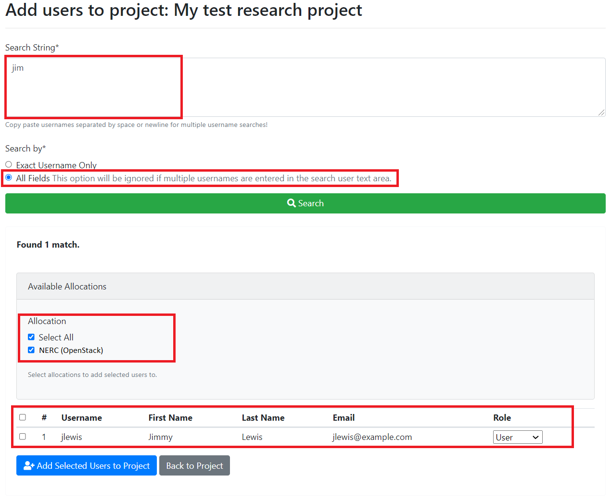
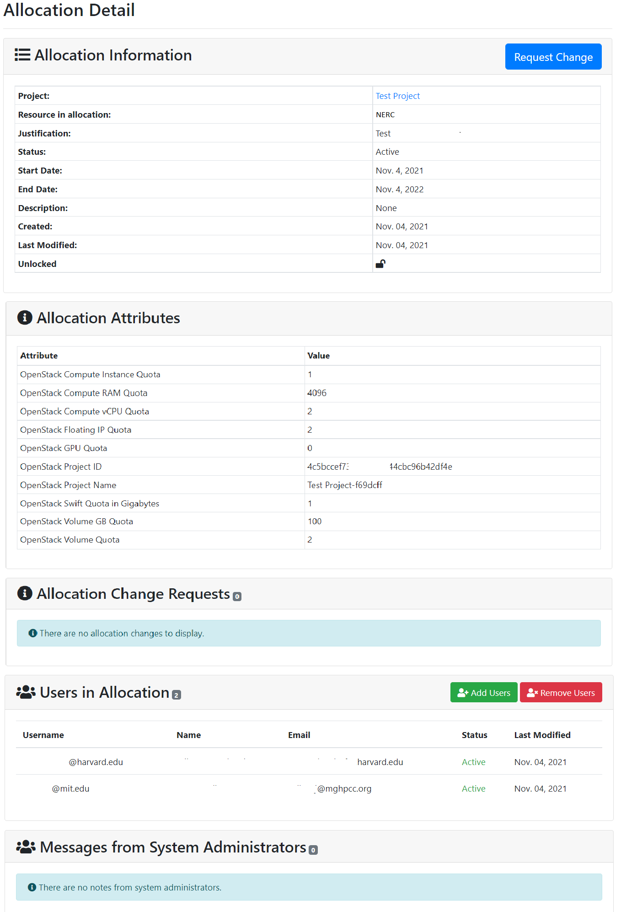

# What is NERC's ColdFront?

NERC uses an open source resource allocation management system called
[ColdFront](https://github.com/ubccr/coldfront) to provide a single point-of-entry
for administration, reporting, and measuring scientific impact of NERC resources
for PI.

## How to get access to NERC's ColdFront

General Users who are not PIs or Managers on a project see a read-only view of the
NERC's ColdFront.

Whereas, once a PI Account request is granted, the PI will receive an email confirming
the request approval and how to connect NERC’s ColdFront.

PIs or Project Owners can use NERC's ColdFront as a self-service web-portal to do
the following tasks:

- Add or manage or archive projects

- Request allocations that fall under projects to NERC’s resources such as clusters,
cloud resources, servers, storage, and software licenses

- Add/remove user access to/from allocated resources who is a member of the project
without requiring system administrator interaction

- Elevate selected users to 'manager' status, allowing them to handle some of the
PI asks such as request new resource allocations, add/remove users to/from resource
allocations, add project data such as grants and publications

- Monitor resource utilization such as storage and cloud usage

- Receive email notifications for expiring/renewing access to resources as well as
notifications when allocations change status - i.e. activated, expired, denied

- Provide information such as grants, publications, and other reportable data for
periodic review by center director to demonstrate need for the resources

## What PIs need to fill in order to request a Project?

Once logged in to NERC’s ColdFront, PIs can choose Projects sub-menu located under
the Project menu.

On clicking the "Add a project" button will show interface like below:

PIs need to specify appropriate title, description of their research work that you
will accomplish at NERC in one to two paragraphs and Field of science or research
domain and then click the "Save" button. Once saved successfully, PIs effectively
become the "manager" of the project, and are free to add or remove users and also
request resource allocation(s) to any Projects for which they are the PI. PIs are
permitted to add users to their group, request new allocations, renew expiring
allocations, and provide information such as publications and grant data. PIs can
maintain all their research information under one project or if they require they
can separate the work into multiple projects.

!!!warning "Very Important"
    Make sure to select **NERC (OpenStack)** on Resource option and specify
    your expected Units of computing. Be mindful, you can extend your current resource
    allocations on your current project later on.

## Resource Allocation Quotas

The amount of quota to start out a resource allocation after approval, can be
specified using an integer field in the resource allocation request form as shown
above. The provided unit value is computed as PIs or project managers request
resource quota. The basic unit of computational resources is defined in terms of
integer value that corresponds to multiple openstack resource quotas. For example,
1 Unit corresponds to:

| Resource Name         | Quota Amount x Unit                   |
| :-------------------: | :-----------------------------------: |
| `Instances`           | 1                                     |
| `vCPUs`               | 2                                     |
| `RAM`                 | 4096                                  |
| `Volumes`             | 1                                     |

## Adding and removing User from the Project

A user can only view projects they are on. PIs or managers can add or remove users
from their respective projects by navigating to the Users section of the project.

Once we click on the "Add Users" button, it will shows the following search interface:

They can search for any users in the system that are not already part of the project
by providing exact matched username or partial text of other multiple fields. The
search results show details about the user account such as email address, username,
first name, last name etc. as shown below:

Thus, found user(s) can be selected and assigned directly to the available resource
allocation(s) on the given project using this interface. While adding the users,
their Role also can be selected from the dropdown options as either User or Manager.
Once confirmed with selection of user(s) their roles and allocations, click on the
"Add Selected Users to Project" button.

Removing Users from the Project is straightforward by just clicking on the
"Remove Users" button. Then it shows the following interface:

PIs or project owners can select the user(s) and then click on the "Remove Selected
Users From Project" button.

## User Roles

Access to ColdFront is role based so users see a read-only view of the allocation
details for any allocations they are on. PIs see the same allocation details as general
users and can also add project users to the allocation if they're not already on
it. Even on the first time, PIs add any user to the project as the User role. Later
PIs or project owners can upgrade users on their project to the 'manager' role. This
allows multiple managers on the same project. This provides the user with the same
access and abilities as the PI. The only things a PI can do that a manager can't,
is create a new project or archive a project. All other project related tasks that
a PI can do, a manager on that project can accomplish as well.

General User Accounts are not able to create/update projects and request Resource
Allocations. Instead, these accounts must be associated with a Project that has
Resources. General User accounts that are associated with a Project have access
to view their project details and use all the resources associated with the Project
on NERC.

General Users (not PIs or Managers) can turn off email notifications at the project
level. PIs also have the 'manager' status on a project. Managers can't turn off their
notifications. This ensures they continue to get allocation expiration notification
emails.

## Adding User to Manager Role

To change a user's role to 'manager' click on the edit icon next to the user's name
on the Project Detail page:

Then toggle the "Role" from User to Manager:

!!!warning "Very Important"
    Make sure to click the "Update" button to save the change.

## PI and Manager Allocation View

PIs and managers can view important details of the allocation including start and
end dates, creation and last modified dates, users on the allocation and public
allocation attributes. PIs and managers can add or remove users from allocations.

## Adding and removing project Users to project Resource Allocation

Any available users on a given project can be added to resource allocation by
clicking on the "Add Users" button as shown below:

Once Clicked it will show the following interface where PIs can select the available
user(s) on the checkboxes and click on the "Add Selected Users to Allocation" button.

!!!warning "Very Important"
    The desired user must already be on the project to be added to the allocation.

Removing Users from the Resource Allocation is straightforward by just clicking on
the "Remove Users" button. Then it shows the following interface:

PIs or project owners can select the user(s) on the checkboxes and then click on
the "Remove Selected Users From Project" button.

## Adding a new Resource Allocation to the project

If one resource allocation is not sufficient for a project, PIs or project owners
can request for another allocation(s) by clicking on the "Request Resource Allocation"
button on the Allocations section of the project details. This will show the page
where all existing users for the project will be listed on the bottom of the request
form. PIs can select all or only desired user(s) to request the resource allocations
to be available on NERC’s OpenStack.

## General User View

General Users who are not PIs or Managers on a project see a read-only view of the
allocation details. If a user is on a project but not a particular allocation, they
will not be able to see the allocation in the Project view nor will they be able
to access the Allocation detail page.

