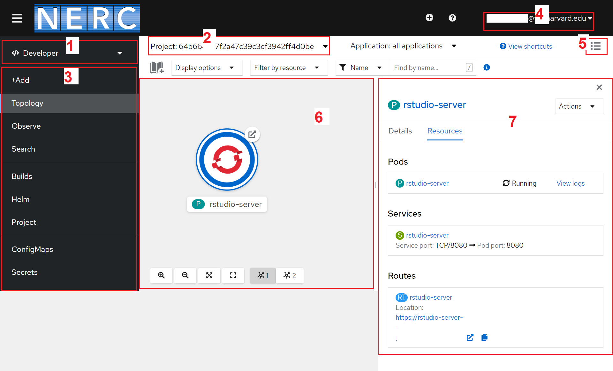
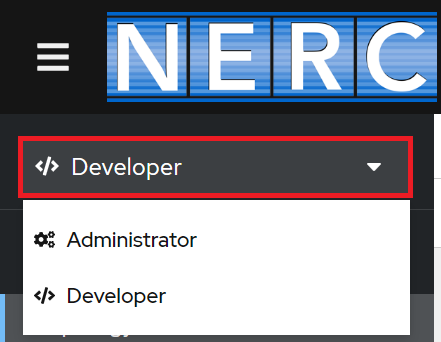
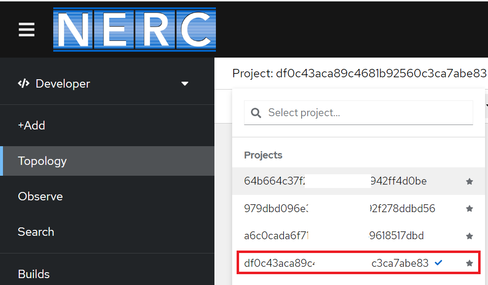

# Web Console Overview

The NERC's OpenShift Container Platform web console a web-based user interface
which can be browsed from [https://console.apps.shift.nerc.mghpcc.org](https://console.apps.shift.nerc.mghpcc.org).
for performing common management tasks such as building and deploying applications.
It provides tools to manage your application code and data, access to it.

Below is a sample screenshot of the web interface with labels describing different
sections of the NERC's OpenShift Web Console:

1. Perspective Switcher - Drop-down to select a different perspective. The available
perspectives are a **Developer view** and an **Administrator view**.

2. Project List - Drop-down to select a different project. Based on user's active
and approved resource allocations this projects list will be updated.

3. Navigation Menu - Menu options to access different tools and settings for a project.
The list will change depending on which Perspective view you are in.

4. User Preferences - Shown the option to get and copy the OpenShift Command Line
*oc login command* and set your individual console preferences including default
views, language, import settings, and more.

5. View Switcher - This three dot menu is used to switch between **List View**
and **Graph view** of all your applications.

6. Main Panel - Displays basic application information. Clicking on the application
names in the main panel expands the Details Panel (7).

7. Details Panel - Displays additional information about the application selected
from the Main Panel. This includes detailed information about the running application,
applications builds, routes, and more. Tabs at the top of this panel will change
the view to show additional information such as Details and Resources.

---

## Perspective Switcher

When you logged-in, you will be redirected to the **Developer** perspective which
is shown selected on the perspective switcher located at the Left side. You can switch
between the **Administrator** perspective and the **Developer** perspective as per
your roles and permissions in a project.

### About the Administrator perspective in the web console

The **Administrator** perspective enables you to view the cluster inventory, capacity,
general and specific utilization information, and the stream of important events,
all of which help you to simplify planning and troubleshooting tasks. Both project
administrators and cluster administrators can view the Administrator perspective.

!!! note "Important Note"
    The default web console perspective that is shown depends on the role of the
    user. The **Administrator** perspective is displayed by default if the user is
    recognized as an administrator.

### About the Developer perspective in the web console

The **Developer** perspective offers several built-in ways to deploy applications,
services, and databases.

!!! info "Important Note"
    The default view for the OpenShift Container Platform web console is the **Developer**
    perspective.

The web console provides a comprehensive set of tools for managing your projects
and applications.

## Project List

You can select or switch your projects from the available project drop-down list
located on top navigation as shown below:

!!! info "Important Note"
    You can identify the currently selected project with **tick** mark and also
    you can click on **star** icon to keep the project under your **Favorites** list.

## Navigation Menu

### Topology

The **Topology** view in the Developer perspective of the web console provides a
visual representation of all the applications within a project, their build status,
and the components and services associated with them. If you have no workloads or
applications in the project, the Topology view displays the available options to
create applications. If you have existing workloads, the Topology view graphically
displays your workload nodes. To read more about how to view the topology of
your application please read [this official documentation from Red Hat](https://docs.openshift.com/container-platform/4.10/applications/odc-viewing-application-composition-using-topology-view.html#odc-viewing-application-topology_viewing-application-composition-using-topology-view)

### Observe

This provides you with a Dashboard to view the resource usage and also other metrics
and events that occured on your project. Here you can identify, monitor, and inspect
the usage of Memory, CPU, Network, and Storage in your project.

### Search

This allows you to search any resources based on search criteria like Label or Name.

### Builds

This menu provides tools for building and deploying applications. You can use it
to create and manage build configurations using YAML syntax, as well as view the
status and logs of your builds.

### Helm

You can enable the Helm Charts here. Helm Charts is the pacakge manager that help
to easily manage definitions, installations and upgrades of you complex application.
It also shows catalog of all available helm charts for you to use by installing them.

### Project

This allows you to view the overview of the currently selected project from the
drop-down list and also details about it including resource utilization and
resource quotas.

### ConfigMaps

This menu allows you to view or create a new ConfigMap by entering manually YAML
or JSON definitions, or by dragging and dropping a file into the editor.

### Secrets

This allows you to view or create Secrets that allows to inject sensitive data
into your application as files or environment variables.

---
