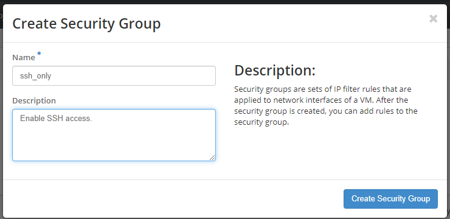
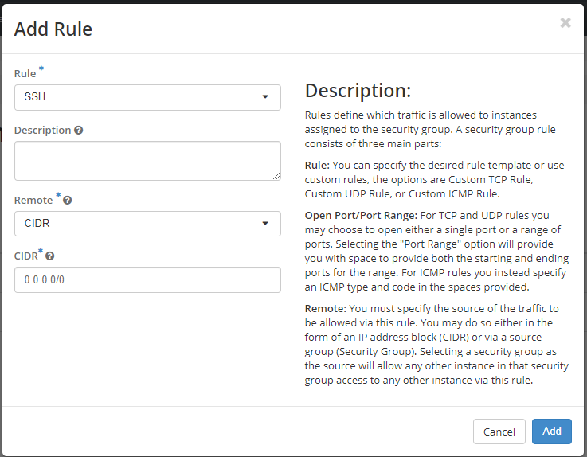

Before you launch an instance, you should add security group rules to enable users to ping and use SSH to connect to the instance. Security groups are sets of IP filter rules that define networking access and are applied to all instances within a project. To do so, you either add rules to the default security group Add a rule to the default security group or add a new security group with rules.

You can view security groups by clicking Project, then click Network panel and choose Security Groups from the tabs that appears.

You should see a ‘default’ security group. The default security group allows traffic only between members of the security group, so by default you can always connect between VMs in this group. However, it blocks all traffic from outside, including incoming SSH connections. In order to access instances via a public IP, an additional security group is needed.

Security groups are very highly configurable, so you can create different security groups for different types of VMs used in your project.

For example, for a VM that hosts a web page, you need a security group which allows access to ports 80 and 443.

You can also limit access based on where the traffic originates, using either IP addresses or security groups to define the allowed sources.

### Create a new Security Group
Click on "Create Security Group"  Give your new group a name, and a brief description.

You will see some existing rules:

Let's create the new rule to allow SSH. Click on "Add Rule".

You will see there are a lot of options you can configure on the Add Rule dialog box.

Enter the following values:

- Rule: SSH
- Remote: CIDR
- CIDR: 0.0.0.0/0

!!! note "Note"
    To accept requests from a particular range of IP addresses, specify the IP address block in the CIDR box.

The new rule now appears in the list. This signifies that any instances using this newly added Security Group will now have SSH port 22 open for requests from any IP address.

### Allowing Ping
The default configuration blocks ping responses, so you will need to add an additional group and/or rule 
if you want your public IPs to respond to ping requests.

Ping is ICMP traffic, so the easiest way to allow it is to add a new rule and choose "ALL ICMP" from the dropdown.

In the Add Rule dialog box, enter the following values:

- Rule: All ICMP
- Direction: Ingress
- Remote: CIDR
- CIDR: 0.0.0.0/0

Instances will now accept all incoming ICMP packets.

---
