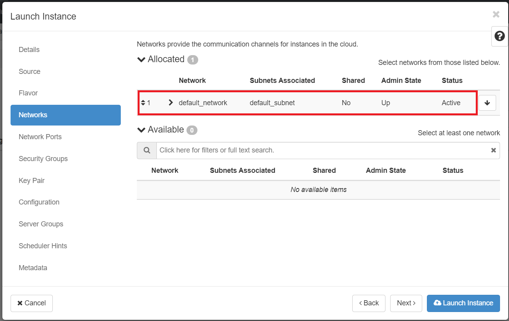
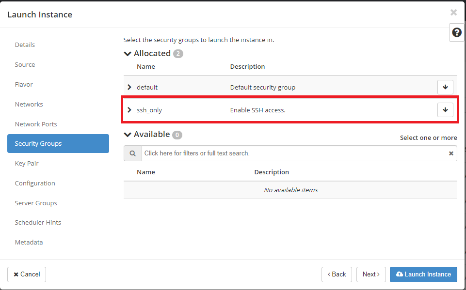
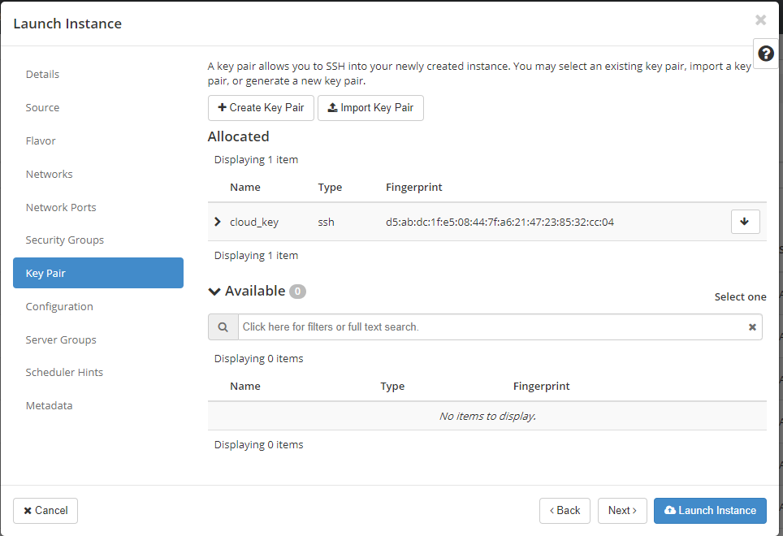

### Background
To start a VM, we will need a base image.  NERC has made several Public images available to users.

### Launch an Instance
Navigate: Project -> Compute -> Images.

Click Launch Instance next to the public image of your choice. In the example, we chose **ubuntu-21.04-x86_64**.

*Important: There are multiple tabs along the top of the the pop up window.

Make sure you review all of them as per instructions before clicking on Launch! Otherwise, your launched VM may be inaccessible.*

In the Launch Instance dialog box, specify the following values:

- **Details** tab

Instance Name: Give your instance a name that assign a name to the virtual machine.

*NOTE: The name you assign here becomes the initial host name of the server. If the name is longer than 63 characters, the Compute service truncates it automatically to ensure dnsmasq works correctly.*

Availability Zone: By default, this value is set to the availability zone given by the cloud provider i.e. `nova`.

Count: To launch multiple instances, enter a value greater than 1. The default is 1.

- **Source** tab: Double check that in the dropdown "Select Boot Source," "Image" is selected.

To create an image that uses the boot volume sized according to the flavor ensure that "No" is selected under the "Create New Volume" section as shown here:

- **Flavor** tab: Specify the size of the instance to launch. Choose `m1.small` from the 'Flavor' tab by clicking on the "+" icon.

*NOTE: the default flavor is `m1.small` which is too small for the base images so please not use it.*

After choosing m1.small, you should see it moved up to "Allocated".

- **Networks:** tab: Make sure the Private Network you just created is moved up to "Allocated". If not, you can click on the "+" icon in "Available".

- **Security Groups:** tab: Make sure to add the security group where you enabled SSH.

- **Key Pair:** Add the key pair you created for your local machine/ alptop to use with this VM.

*NOTE: If you did not provide a key pair, security groups, or rules, users can access the instance only from inside the cloud through VNC. Even pinging the instance is not possible without an ICMP rule configured.*

- **Network Ports, Configuration, Server Groups, Schedular Hints, and Metadata:** tab: Ignore these tabs for now.

You are now ready to launch your VM - go ahead and click "Launch Instance"! This will initiate a instance on a compute node in the cloud.

On a successful launch you would be redirected to Compute -> Instances tab and can see the VM spawning.

Once your VM is successfully running you will see the **Power State** changes from "No State" to "running".

*NOTE: You can also launch an instance from the "Instances" or "Volumes" category when you launch an instance from an instance or a volume respectively.*

---
