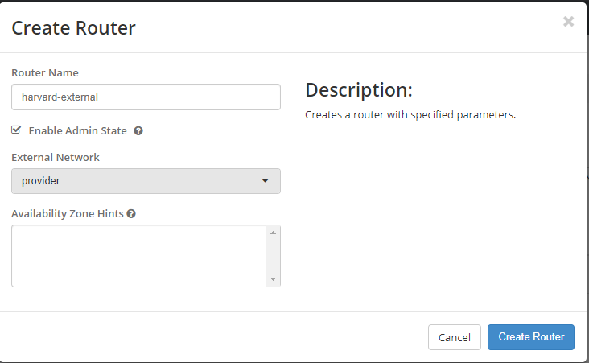
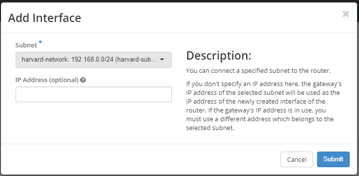
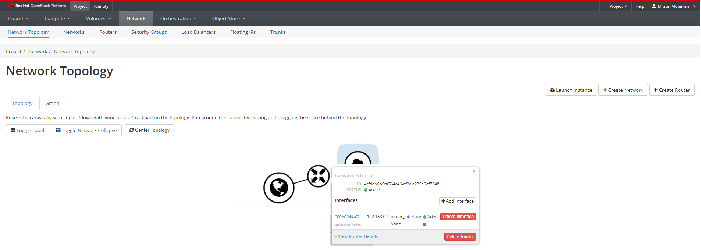

# Create a Router

A router acts as a gateway for external connectivity.

By connecting your private network to the public network via a router, you can connect your instance to the Internet,
install packages, etc. without needing to associate it with a public IP address.

You can view routers by clicking Project, then click Network panel and choose Routers from the tabs that appears.

Click "Create Network" button on the right side of the screen.

In the Create Router dialog box, specify a name for the router.

From the External Network dropdown, select the ‘provider’ network, and click "Create Router" button. This will set the Gateway for the new router to public network.

The new router is now displayed in the Routers tab. You should now see the router in the Network Topology view. (It also appears under Project -> Network -> Routers).

Notice that it is now connected to the public network, but not your private network.

## Set Internal Interface on the Router

In order to route between your private network and the outside world, you must give the router an interface on your private network.

Perform the following steps in order to To connect a private network to the newly created router:

a. On the Routers tab, click the name of the router.

b. On the Router Details page, click the Interfaces tab, then click Add Interface.

c. In the Add Interface dialog box, select a Subnet.

Optionally, in the Add Interface dialog box, set an IP Address for the router interface for the selected subnet.

If you choose not to set the IP Address value, then by default OpenStack Networking uses the first host IP address in the subnet.

The Router Name and Router ID fields are automatically updated.

d. Click "Add Interface".

The Router will now appear connected to the private network in Network Topology tab.

**OR,**

You can set Internal Interface on the Router From the Network Topology view, click on the router you just created, and click ‘Add Interface’ on the popup that appears.

Then, this will show Add Interface dialog box. So, you just complete steps b to c as mentioned above.

---
