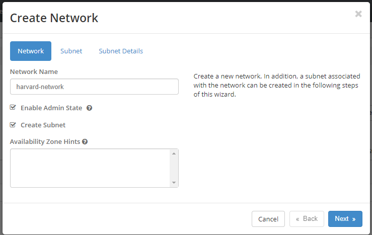
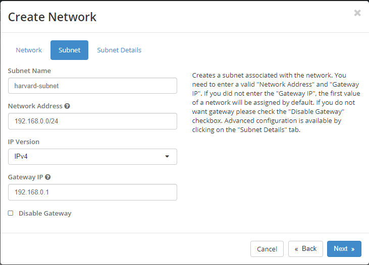
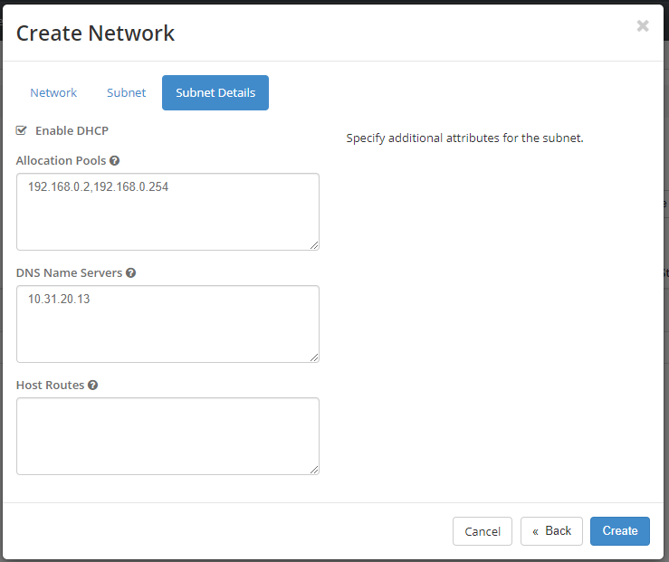

# Set up a Private Network

## Create a Network

You can view your/ existing network topology by clicking Project, then click
Network panel and choose Network Topology from the tabs that appears. This
shows public network which is accessible to all projects.


Click on "Networks" tab and then click "Create Network" button on the right
side of the screen.

In the Create Network dialog box, specify the following values.

- Network tab:

Network Name: Specify a name to identify the network.

Shared: Share the network with other projects. Non admin users are not allowed
to set shared option and not even visible to them.

Admin State: The state to start the network in.

Create Subnet: Select this check box to create a subnet

Give your network a name, and leave the two checkboxes for "Admin State" and
"Create Subnet" with the default settings.



- Subnet tab:
You do not have to specify a subnet when you create a network, but if you do
not specify a subnet, the network can not be attached to an instance.

Subnet Name: Specify a name for the subnet.

Network Address: Specify the IP address for the subnet. For your private
networks, you should use IP addresses which fall within the ranges that are
specifically reserved for private networks:

```sh
  10.0.0.0/8
  172.16.0.0/12
  192.168.0.0/16
```

In the example below, we configure a network containing addresses 192.168.0.1
to 192.168.0.255 using CIDR 192.168.0.0/24
*Technically, your private network will still work if you choose any IP outside
these ranges, but this causes problems with connecting to IPs in the outside
world - so don't do it!*



IP Version: Select IPv4 or IPv6.

Gateway IP: Specify an IP address for a specific gateway. This parameter is optional.

Disable Gateway: Select this check box to disable a gateway IP address.

- Subnet Details tab

Enable DHCP: Select this check box to enable DHCP so that your VM instances
will automatically be assigned an IP on the subnet.

Allocation Pools: Specify IP address pools.

DNS Name Servers: Specify a name for the DNS server. If you use '8.8.8.8' (you
may recognize this as one of Google's public name servers).

Host Routes: Specify the IP address of host routes.

For now, you can leave the Allocation Pools and Host Routes boxes empty and
click on "Create" button. But here we specify Allocation Pools of `192.168.0.2,192.168.0.254`.



The Network Topology should now show your virtual private network next to the
public network.


---
