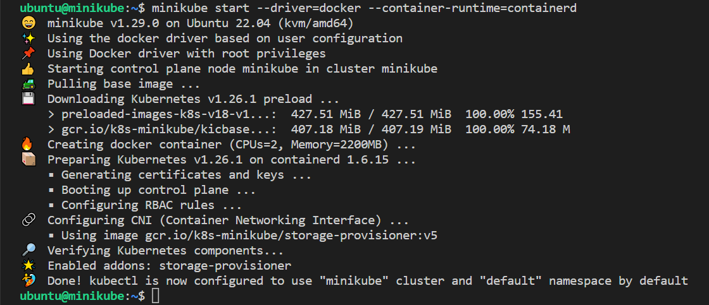
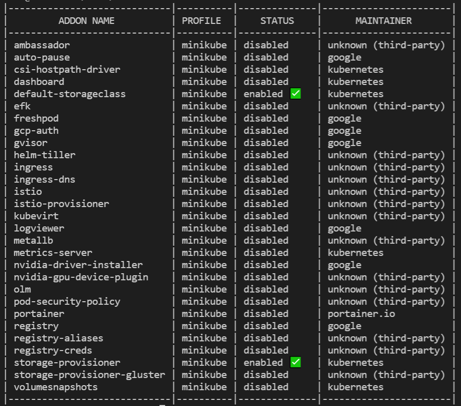
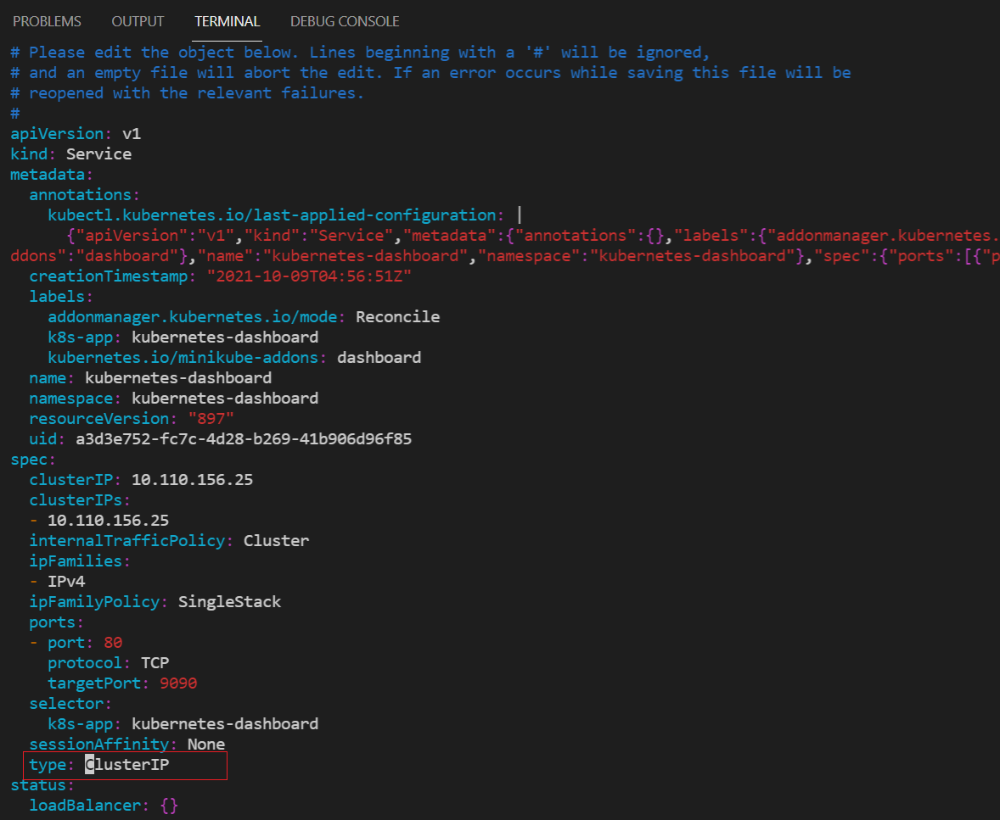
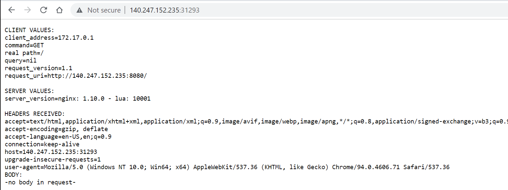

# Minikube

## Minimum system requirements for minikube

- 2 GB RAM or more
- 2 CPU / vCPUs or more
- 20 GB free hard disk space or more
- Docker / Virtual Machine Manager – KVM & VirtualBox. Docker, Hyperkit, Hyper-V,
KVM, Parallels, Podman, VirtualBox, or VMWare are examples of container or virtual
machine managers.

## Pre-requisite

We will need 1 VM to create a single node kubernetes cluster using `minikube`.
We are using following setting for this purpose:

- 1 Linux machine for master, ubuntu-21.04-x86_64, m1.medium flavor with 2vCPU,
4GB RAM, 10GB storage - also [assign Floating IP](../../openstack/create-and-connect-to-the-VM/assign-a-floating-IP.md)
 to this VM.
- setup Unique hostname to the machine using the following command:

```sh
echo "<node_internal_IP> <host_name>" >> /etc/hosts
hostnamectl set-hostname <host_name>
```

For example,

```sh
echo "192.168.0.62 minikube" >> /etc/hosts
hostnamectl set-hostname minikube
```

## Install Minikube on Ubuntu

Run the below command on the Ubuntu VM:

- SSH into **minikube** machine
- Switch to root user: `sudo su`

- Update the repositories and packages:

```sh
apt-get update && apt-get upgrade -y
```

- Install `curl`, `wget`, and `apt-transport-https`

```sh
apt-get update && apt-get install -y curl wget apt-transport-https
```

---

## Install **Docker**

- Install container runtime - **docker**

```sh
sudo apt-get install docker.io -y
```

- Configure the Docker daemon, in particular to use systemd for the management
of the container’s cgroups

```sh
cat <<EOF | sudo tee /etc/docker/daemon.json
{
"exec-opts": ["native.cgroupdriver=systemd"]
}
EOF

systemctl enable --now docker
usermod -aG docker ubuntu
systemctl daemon-reload
systemctl restart docker
```

**OR,** you can install VirtualBox Hypervisor as runtime:

```sh
sudo apt install virtualbox virtualbox-ext-pack -y
```

---

## Install **kubectl**

- Install kubectl binary
• **kubectl**: the command line util to talk to your cluster.

```sh
snap install kubectl --classic
```

This outputs: `kubectl 1.22.2 from Canonical✓ installed`

- Now verify the kubectl version:

```sh
kubectl version -o yaml
```

---

## Installing minikube

- Install minikube

```sh
curl -LO https://storage.googleapis.com/minikube/releases/latest/minikube_latest_amd64.deb
sudo dpkg -i minikube_latest_amd64.deb
```

**OR,** install minikube using `wget`:

```sh
wget https://storage.googleapis.com/minikube/releases/latest/minikube-linux-amd64
cp minikube-linux-amd64 /usr/bin/minikube
chmod +x /usr/bin/minikube
```

- Verify the Minikube installation:

```sh
minikube version

minikube version: v1.23.2
commit: 0a0ad764652082477c00d51d2475284b5d39ceed
```

- Install conntrack:
Kubernetes 1.22.2 requires conntrack to be installed in root's path:

```sh
apt-get install -y conntrack
```

- Start minikube:
As we are already stated in the beginning that we would be using docker as base
for minikue, so start the minikube with the docker driver,

```sh
minikube start --driver=none
```

!!! note "Note"
    - To check the internal IP, run the `minikube ip` command.
    - By default, Minikube uses the driver most relevant to the host OS. To
    use a different driver, set the `--driver` flag in `minikube start`. For
    example, to use Docker instead of others or none, run
    `minikube start --driver=docker`. To persistent configuration so that
    you to run minikube start without explicitly passing i.e. in global scope the
    `--vm-driver docker` flag each time, run:
    `minikube config set vm-driver docker`.
    ---
    - In case you want to start minikube with customize resources and want installer
    to automatically select the driver then you can run following command,
    `minikube start --addons=ingress --cpus=2 --cni=flannel --install-addons=true
    --kubernetes-version=stable --memory=6g`

Output would like below:


Perfect, above confirms that minikube cluster has been configured and started successfully.

- Run below minikube command to check status:

```sh
minikube status

minikube
type: Control Plane
host: Running
kubelet: Running
apiserver: Running
kubeconfig: Configured
```

- Run following kubectl command to verify the cluster info and node status:

```sh
kubectl cluster-info

Kubernetes control plane is running at https://192.168.0.62:8443
CoreDNS is running at https://192.168.0.62:8443/api/v1/namespaces/kube-system/services/kube-dns:dns/proxy

To further debug and diagnose cluster problems, use 'kubectl cluster-info dump'.
```

```sh
kubectl get nodes

NAME       STATUS   ROLES                  AGE   VERSION
minikube   Ready    control-plane,master   5m    v1.22.2
```

- To see the kubectl configuration use the command:

```sh
kubectl config view
```

The output looks like:


- Get minikube addon details:

```sh
minikube addons list
```

The output will display like below:


If you wish to enable any addons run the below minikube command,

```sh
minikube addons enable <addon-name>
```

- Enable minikube dashboard addon:

```sh
minikube dashboard

🔌  Enabling dashboard ...
    ▪ Using image kubernetesui/metrics-scraper:v1.0.7
    ▪ Using image kubernetesui/dashboard:v2.3.1
🤔  Verifying dashboard health ...
🚀  Launching proxy ...
🤔  Verifying proxy health ...
http://127.0.0.1:40783/api/v1/namespaces/kubernetes-dashboard/services/http:kubernetes-dashboard:/proxy/
```

- To view minikube dashboard url:

```sh
minikube dashboard --url

🤔  Verifying dashboard health ...
🚀  Launching proxy ...
🤔  Verifying proxy health ...
http://127.0.0.1:42669/api/v1/namespaces/kubernetes-dashboard/services/http:kubernetes-dashboard:/proxy/
```

- Expose Dashboard on **NodePort** instead of **ClusterIP**:

-- Check the current port for `kubernetes-dashboard`:

```sh
kubectl get services -n kubernetes-dashboard
```

The output looks like below:


```sh
kubectl edit service kubernetes-dashboard -n kubernetes-dashboard
```

-- Replace type: "ClusterIP" to "NodePort":



-- After saving the file:
Test again: `kubectl get services -n kubernetes-dashboard`

Now the output should look like below:


So, now you can browser the K8s Dashboard, visit `http://<Floating-IP>:<NodePort>`
i.e. <http://140.247.152.235:31881> to view the Dashboard.

### Deploy A Sample Nginx Application

- Create a deployment, in this case **Nginx**:
A Kubernetes Pod is a group of one or more Containers, tied together for the purposes
of administration and networking. The Pod in this tutorial has only one Container.
A Kubernetes Deployment checks on the health of your Pod and restarts the Pod's
Container if it terminates. Deployments are the recommended way to manage the creation
and scaling of Pods.

- Let's check if the Kubernetes cluster is up and running:

```sh
kubectl get all --all-namespaces
kubectl get po -A
kubectl get nodes
```

```sh
kubectl create deployment --image nginx my-nginx
```

- To access the deployment we will need to expose it:

```sh
kubectl expose deployment my-nginx --port=80 --type=NodePort
```

To check which NodePort is opened and running the Nginx run:

```sh
kubectl get svc
```

The output will show:


**OR,**

```sh
minikube service list

|----------------------|---------------------------|--------------|-------------|
|      NAMESPACE       |           NAME            | TARGET PORT  |       URL   |
|----------------------|---------------------------|--------------|-------------|
| default              | kubernetes                | No node port |
| default              | my-nginx                  |           80 | http:.:31081|
| kube-system          | kube-dns                  | No node port |
| kubernetes-dashboard | dashboard-metrics-scraper | No node port |
| kubernetes-dashboard | kubernetes-dashboard      |           80 | http:.:31929|
|----------------------|---------------------------|--------------|-------------|
```

**OR,**

```sh
kubectl get svc my-nginx
minikube service my-nginx --url
```

Once the deployment is up, you should be able to access the Nginx home page on
the allocated NodePort from the node's Floating IP.

Go to browser, visit `http://<Floating-IP>:<NodePort>`
i.e. <http://140.247.152.235:31081/> to check the nginx default page.

For your example,


---

### Deploy A Hello Minikube Application

- Use the kubectl create command to create a Deployment that manages a Pod. The Pod
runs a Container based on the provided Docker image.

```sh
kubectl create deployment hello-minikube --image=k8s.gcr.io/echoserver:1.4
kubectl expose deployment hello-minikube --type=NodePort --port=8080
```

- View the port information:

```sh
kubectl get svc hello-minikube
minikube service hello-minikube --url
```

Go to browser, visit `http://<Floating-IP>:<NodePort>`
i.e. <http://140.247.152.235:31293/> to check the hello minikube default page.

For your example,



### Clean up

Now you can clean up the app resources you created in your cluster:

```sh
kubectl delete service my-nginx
kubectl delete deployment my-nginx

kubectl delete service hello-minikube
kubectl delete deployment hello-minikube
```

---

### Managing Minikube Cluster

- To stop the minikube, run

```sh
minikube stop
```

- To delete the single node cluster:

```sh
minikube delete
```

- To Start the minikube, run

```sh
minikube start
```

- In case you want to start the minikube with higher resource like 8 GB RM and 4
CPU then execute following commands one after the another.

```sh
minikube config set cpus 4
minikube config set memory 8192
minikube delete
minikube start
```

---
